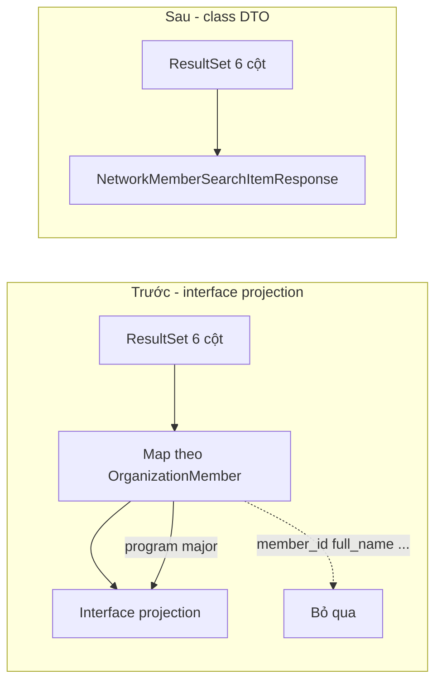

# Network Member Search — R2DBC mapping (null fields)

Tài liệu giải thích lỗi API `GET /api/chat/network/members` trả về `memberId`, `fullName`, `startYear`, `avatarUrl` = `null` trong khi `program`, `major` vẫn có giá trị, dù dữ liệu trong PostgreSQL là đầy đủ.

**Liên quan code:**

| Thành phần | Đường dẫn |
|------------|-----------|
| Repository | `backend/.../chat/dao/NetworkMemberSearchRepository.java` |
| Service | `backend/.../chat/service/NetworkMemberSearchService.java` |
| DTO response | `backend/.../chat/dto/NetworkMemberSearchItemResponse.java` |
| Controller | `backend/.../chat/controller/NetworkMemberSearchController.java` |

---

## 1. Triệu chứng

Response mẫu (sai):

```json
{
  "memberId": null,
  "fullName": null,
  "program": "Regular",
  "major": "Computer Science",
  "startYear": null,
  "avatarUrl": null
}
```

- `totalItem` / `COUNT` vẫn đúng → SQL JOIN và `WHERE` chạy ổn, có bản ghi.
- Chỉ **bước map ResultSet → object Java** bị thiếu field, không phải query không ra dữ liệu.

---

## 2. Nguyên nhân gốc (cụ thể)

### 2.1. Repository gắn với entity `OrganizationMember`

```java
public interface NetworkMemberSearchRepository
        extends ReactiveCrudRepository<OrganizationMember, Integer>
```

Spring Data R2DBC biết **domain type** của repository là `OrganizationMember`. Mọi `@Query` trên interface này được xử lý trong ngữ cảnh metadata của entity đó (bảng `organization_members`, các `@Column` đã khai báo).

### 2.2. Câu SELECT trả về nhiều cột *không thuộc* entity

Query search JOIN thêm `users`, `global_profiles`, `academic_records` và alias:

| Alias trong SQL | Nguồn | Có trên `OrganizationMember`? |
|---------------|--------|----------------------------------|
| `member_id` | `om.id` | Không (entity dùng field `id`, cột `id`) |
| `full_name` | `gp.full_name` | Không |
| `program` | `om.program` | **Có** |
| `major` | `om.major` | **Có** |
| `start_year` | `ar.start_year` | Không |
| `avatar_url` | `u.avatar_url` | Không |

### 2.3. Interface projection bị “lọc” theo entity

Khi method trả về **interface** (ví dụ `NetworkMemberSearchProjection` với `getMemberId()`, `getFullName()`, …), Spring Data R2DBC (phiên bản dùng trong project) thường **chỉ bind các cột có thể gán được lên domain type `OrganizationMember`**, rồi mới chiếu sang projection.

Hệ quả:

- `program`, `major` → trùng tên cột / property trên entity → **có giá trị**.
- `member_id`, `full_name`, `start_year`, `avatar_url` → **không có property tương ứng trên entity** → binder bỏ qua → getter trên projection trả về **`null`**.

Đây là lý do log `row.getFullName()` trong service vẫn `null` dù `SELECT gp.full_name` trong DB có dữ liệu.

> **Lưu ý:** Đây không phải lỗi PostgreSQL hay thiếu row; là hành vi mapping của Spring Data R2DBC khi kết hợp **ReactiveCrudRepository&lt;Entity&gt;** + **interface projection** + **SELECT JOIN nhiều bảng**.

### 2.4. Vì sao dễ hiểu nhầm là “DB null”

- `program` / `major` hiển thị đúng → trông như API “một phần hoạt động”.
- Developer kiểm tra SQL tay trong psql thấy đủ cột → kết luận nhầm là lỗi `toResponse()` hoặc logic service.

Thực tế: dữ liệu có trong ResultSet, nhưng **không được gán vào object projection**.

---

## 3. Cách xử lý đã áp dụng

### 3.1. Trả về **class DTO** thay vì interface projection

```java
Flux<NetworkMemberSearchItemResponse> searchMembers(...);
```

`NetworkMemberSearchItemResponse` là class POJO (`@Data`, `@NoArgsConstructor`, `@AllArgsConstructor`) — cùng kiểu pattern với `UserProfileResponse` trong `UserProfileRepository` (JOIN nhiều bảng, alias `snake_case`, field Java `camelCase`).

Spring map trực tiếp cột → property trên **class đích**, không bị giới hạn chỉ các field của `OrganizationMember`.

### 3.2. Giữ alias SQL rõ ràng

```sql
SELECT om.id AS member_id,
       gp.full_name AS full_name,
       om.program AS program,
       om.major AS major,
       ar.start_year AS start_year,
       u.avatar_url AS avatar_url
```

Quy ước: `snake_case` alias ↔ `camelCase` trong DTO (`member_id` → `memberId`).

### 3.3. Đã xóa `NetworkMemberSearchProjection`

Interface projection không dùng cho query JOIN này trên repository `OrganizationMember`.

---

## 4. Sơ đồ luồng (trước / sau)



---

## 5. Quy tắc cho query tương tự sau này

1. **`@Query` JOIN nhiều bảng, cột vượt ra ngoài một entity**  
   → Trả về **class DTO** (hoặc `record` với constructor binding), không dùng interface projection trên `ReactiveCrudRepository<Entity>`.

2. **Tham chiếu pattern ổn định trong codebase**  
   - `UserProfileRepository` → `UserProfileResponse`  
   - `NetworkMemberSearchRepository` → `NetworkMemberSearchItemResponse`

3. **Alias SQL**  
   - Luôc `AS snake_case` khớp property DTO.  
   - Tránh chỉ `SELECT om.*` khi cần cột từ bảng khác.

4. **Nếu bắt buộc dùng interface projection**  
   - Tách repository không gắn domain entity chỉ để search, **hoặc**  
   - Dùng `DatabaseClient` / `R2dbcEntityTemplate` map tay — phức tạp hơn, chỉ khi cần.

5. **Debug**  
   - Nếu một vài cột entity có giá trị, cột JOIN null → nghi mapping, chạy SQL trực tiếp trước khi sửa service.

---

## 6. `academic_records` và `DISTINCT ON`

Một `organization_members.id` có thể có **nhiều** dòng `academic_records`. Subquery:

```sql
SELECT DISTINCT ON (member_id) member_id, start_year
FROM academic_records
ORDER BY member_id, start_year DESC NULLS LAST
```

chỉ lấy **một** `start_year` (ưu tiên năm vào lớn nhất) mỗi member — tránh nhân đôi card trên UI. Chi tiết JOIN xem comment trong `NetworkMemberSearchRepository.java`.

---

## 7. API contract (tham khảo frontend)

| Query param | DB / logic |
|-------------|------------|
| `fullName` | `global_profiles.full_name` — LIKE `%value%` |
| `program` | `organization_members.program` — JSON array text search |
| `major` | `organization_members.major` — JSON array text search |
| `startYear` | `academic_records.start_year` — so khớp chính xác |
| `page`, `size` | Phân trang; `page` **0-based** trên backend |
| (ẩn) `organizationId` | Từ JWT (`SecurityUtils.getCurrentOrganizationId()`) |

---

*Cập nhật: sau sự cố mapping null (2026) — fix: DTO class thay interface projection.*
