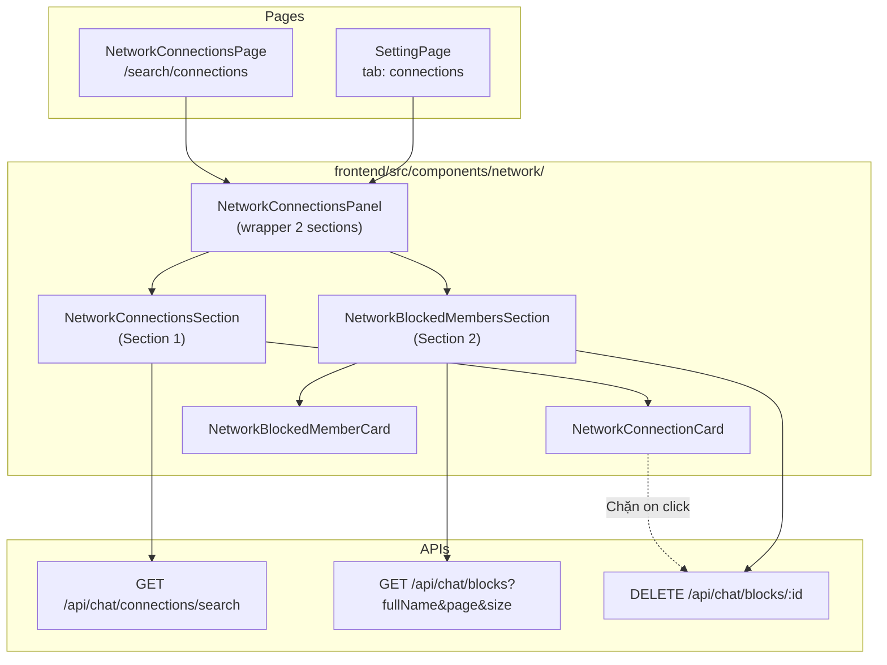

# Plan: Network Connections & Blocked Members Management

## Overview

Thêm khả năng xem và quản lý **kết nối hiện tại** (conversation request `ACCEPTED`) và **danh sách người đã chặn** trên hai màn hình:

| Màn hình | Route | Sidebar label |
|---|---|---|
| Network | `/cs-hcmus/search/connections` | **Kết nối hiện tại** |
| Settings | `/cs-hcmus/settings` → tab **Kết nối** | **Kết nối** |

Cả hai màn hình dùng **cùng một bộ shared components**, gồm **2 sections**:

1. **Section 1 — Kết nối hiện tại**: danh sách peer đã `ACCEPTED`, search theo full name. **Không** embed block status — chặn qua menu ⋯ gọi `POST /blocks`, bỏ chặn chỉ ở Section 2.
2. **Section 2 — Người đã chặn**: danh sách mọi user mà current user đã block (kể cả chưa từng kết nối), search theo full name, chỉ có nút **Bỏ chặn**.

Đồng thời **loại bỏ filter `ACCEPTED`** khỏi tab **Yêu cầu kết nối** (`/search/requests`) — cả frontend lẫn backend — vì tab Kết nối hiện tại đã cover use case này đầy đủ hơn.

---

## Decisions Log (đã chốt với PM)

| # | Quyết định |
|---|---|
| 1 | ~~Filter `blocked`~~ + ~~badge block trên S1~~ → **Option C (11/06/2026):** `connections/search` không JOIN `user_blocks`, không trả `blockedByMe`/`blockedByPeer`. S1 chỉ list kết nối + Chặn (API riêng). Quản lý/bỏ chặn → **Section 2** |
| 2 | Bỏ `ACCEPTED` khỏi tab Yêu cầu kết nối (FE + BE); **không render** badge ACCEPTED trên request card |
| 3 | Nhắn tin (Section 1): `navigate('/chat')`, **không** auto-select conversation |
| 4 | Layout Section 1: **grid 3 cột** giống `NetworkPage` |
| 5 | Network `/search/connections` **cũng có 2 sections** giống Settings |
| 6 | User vừa kết nối vừa bị chặn: **hiện ở cả 2 sections** (chấp nhận trùng) |
| 7 | Section 2: **mở rộng API** `GET /api/chat/blocks` thêm search + pagination |
| 8 | Section 2: **không có** nút Nhắn tin, chỉ **Bỏ chặn** |
| 9 | ~~`blockedByPeer` badge trên S1~~ → **Bỏ** (Option C). Block UX chỉ ở Chat (`private/list`) và Section 2 |
| 10 | Sidebar label: Network = **"Kết nối hiện tại"**, Settings = **"Kết nối"** |

---

## Problem Statement

### API hiện tại không đủ

| API | Vấn đề |
|---|---|
| `GET /api/chat/conversation-requests/search` | Chỉ lấy request **gửi đến mình** (`target_member_id = current`). Không cover khi mình là requester. Trả về thông tin requester, không phải peer. Không có block flags. |
| `GET /api/chat/blocks` | Trả toàn bộ danh sách, không search, không pagination. |

### UX trùng lặp

Tab Yêu cầu kết nối có filter `ACCEPTED` nhưng chỉ hiện một phần kết nối → gây nhầm lẫn với tab Kết nối mới.

---

## Architecture



### Nguyên tắc tái sử dụng

- `NetworkConnectionsPanel` là wrapper chứa cả 2 sections + divider + section titles.
- Dùng chung cho **Network page** và **Settings tab** — chỉ khác `variant` (page header vs embedded).
- Hooks tách riêng: `useNetworkConnections`, `useBlockedMembers`.
- Pattern search/pagination đồng bộ với `NetworkPage` và `NetworkIncomingRequestsPage`.
- Section 1 **không có filter dropdown** và **không embed block status** — SQL chỉ list kết nối + profile; block là concern riêng (Section 2 + Chat).

---

## Changelog

| Ngày | Thay đổi |
|---|---|
| 11/06/2026 | **Option B:** Bỏ filter `blocked` khỏi Section 1 và API `connections/search`. |
| 11/06/2026 | **Option C:** Bỏ `user_blocks` JOIN và `blockedByMe`/`blockedByPeer` khỏi `connections/search` + card S1. Subquery `peer_id` qua `member_low_id`/`member_high_id`. Bỏ chặn chỉ ở Section 2; chặn từ S1 → `POST /blocks` + snackbar. |

---

## Section 1 — Kết nối hiện tại

### Business logic

Lấy tất cả `chat_conversation_requests` với:

- `status = ACCEPTED`
- Current user là `member_low_id` **hoặc** `member_high_id` của cặp
- Peer = `CASE WHEN member_low_id = current THEN member_high_id ELSE member_low_id END`

### UI

| Element | Chi tiết |
|---|---|
| Title | **Kết nối hiện tại** |
| `SearchBar` | Tìm theo họ tên peer — Enter để apply |
| Không có | `DynamicFilterBar` (bỏ filter `blocked` — xem Section 2 để quản lý danh sách chặn) |
| Layout | Grid 3 cột (xs: 1, sm: 2, md: 3) |
| Pagination | `PAGE_SIZE = 5`, pattern giống các tab network khác |
| Empty state | Có/không có criteria → message khác nhau |

### Card — `NetworkConnectionCard`

Hiển thị:

- Avatar, full name
- Program, major (từ `organization_members` của peer)
- **Không có** badge block, **không có** nút Bỏ chặn

Actions:

| Action | Network + Settings Section 1 |
|---|---|
| **Nhắn tin** | ✅ → `navigate('/chat')` |
| **Chặn** (menu ⋯) | ✅ luôn hiện → `POST /api/chat/blocks/:peerMemberId` + confirm dialog + snackbar |
| **Bỏ chặn** | ❌ — chỉ ở Section 2 |

> Nếu đã chặn / bị chặn: API block trả `409`/`403` → snackbar lỗi. User xem danh sách đã chặn tại Section 2.

---

## Section 2 — Người đã chặn

### Business logic

Lấy tất cả records từ `user_blocks` WHERE `blocker_member_id = currentUserId`.

Bao gồm cả user **chưa từng có** conversation request ACCEPTED (ví dụ: chặn từ tab Tìm kiếm).

### UI

| Element | Chi tiết |
|---|---|
| Title | **Người đã chặn** |
| `SearchBar` | Tìm theo họ tên — Enter để apply |
| Layout | Grid 3 cột (đồng bộ Section 1) hoặc list card đơn giản — ưu tiên grid 3 cột cho consistency |
| Pagination | `PAGE_SIZE = 5` |
| Không có | `DynamicFilterBar`, nút Nhắn tin |

### Card — `NetworkBlockedMemberCard`

Hiển thị:

- Avatar, full name
- `blockedAt` (thời điểm chặn)

Actions:

| Action | |
|---|---|
| **Bỏ chặn** | ✅ duy nhất |

### Trùng lặp với Section 1

User vừa kết nối (ACCEPTED) vừa bị mình chặn → xuất hiện **cả Section 1 lẫn Section 2**.

- Section 1: ngữ cảnh "kết nối của tôi"
- Section 2: ngữ cảnh "quản lý danh sách chặn"

Unblock từ section nào cũng được; sau unblock cần **invalidate** cả 2 query keys.

---

## Backend Changes

### 1. New endpoint — `GET /api/chat/connections/search`

**Path:** `/api/chat/connections/search`

**Query params:**

| Param | Type | Required | Mô tả |
|---|---|---|---|
| `fullName` | string | No | Partial match trên `global_profiles.full_name` của peer |
| `page` | int | No | Default `0`, 0-based |
| `size` | int | No | Default `5`, min `1` |

**Response item — `ConnectionSearchItemResponse`:**

| Field | Type | Mô tả |
|---|---|---|
| `connectionId` | Long | `chat_conversation_requests.id` |
| `chatGroupId` | Long | `chat_conversation_requests.chat_group_id` |
| `peerMemberId` | Long | User ID của peer |
| `fullName` | String | Từ `global_profiles` |
| `avatarUrl` | String | Từ `users` |
| `program` | JSON/array | Từ `organization_members` của peer |
| `major` | JSON/array | Từ `organization_members` của peer |
| `connectedAt` | LocalDateTime | `ccr.updated_at` (thời điểm accept) |

**Response wrapper:** `ApiResponse<PaginatedResponse<ConnectionSearchItemResponse>>`

> **Không có** `blockedByMe` / `blockedByPeer` — block status không thuộc connections search.

**SQL logic (tóm tắt):**

```
FROM (
  SELECT ccr.id, ccr.chat_group_id, ccr.updated_at,
    CASE WHEN ccr.member_low_id = :currentUserId
         THEN ccr.member_high_id ELSE ccr.member_low_id END AS peer_id
  FROM chat_conversation_requests ccr
  WHERE ccr.status = 'ACCEPTED'
    AND (ccr.member_low_id = :currentUserId OR ccr.member_high_id = :currentUserId)
) conn
JOIN users u ON u.id = conn.peer_id
LEFT JOIN global_profiles gp ON gp.user_id = conn.peer_id
JOIN organization_members om ON om.user_id = conn.peer_id AND om.organization_id = :orgId
WHERE (:fullName IS NULL OR LOWER(gp.full_name) LIKE LOWER(:fullName))
ORDER BY conn.updated_at DESC
```

**Files mới:**

```
backend/src/main/java/com/service/backend/chat/
├── dao/ConnectionSearchRepository.java
├── dto/ConnectionSearchItemResponse.java
├── service/ConnectionSearchService.java
└── controller/ConnectionSearchController.java
```

**Pattern:** Theo `NetworkMemberSearchService` + `PaginationHelper.paginate()`.

---

### 2. Extend endpoint — `GET /api/chat/blocks`

**Hiện tại:** Trả full list, không params.

**Sau khi mở rộng:**

| Param | Type | Required | Mô tả |
|---|---|---|---|
| `fullName` | string | No | Partial match trên `global_profiles.full_name` |
| `page` | int | No | Default `0` |
| `size` | int | No | Default `5` |

**Response:** `ApiResponse<PaginatedResponse<BlockedMemberItemResponse>>` (thay vì `List`)

> **Breaking change:** Response shape đổi từ array sang paginated object. Kiểm tra mọi nơi gọi `getBlockList()` — hiện chỉ có `useBlockUser` invalidate key, chưa có UI consumer. Cập nhật `chatApi.getBlockList()` và hook mới tương ứng.

**Repository thêm:**

- `searchBlockedMembersByBlockerMemberId(blockerId, fullNamePattern, limit, offset)` → `Flux`
- `countBlockedMembersByBlockerMemberId(blockerId, fullNamePattern)` → `Mono<Long>`

**Files sửa:**

```
UserBlockRepository.java
UserBlockService.java          — thêm searchBlockedMembers(...)
UserBlockController.java       — thêm query params, trả PaginatedResponse
BlockedMemberItemResponse.java — giữ nguyên fields hiện tại
```

---

### 3. Restrict incoming requests search — bỏ `ACCEPTED`

**Endpoint:** `GET /api/chat/conversation-requests/search`

**Thay đổi trong `ChatConversationRequestService.searchIncomingRequests`:**

- Nếu `status = ACCEPTED` → throw `ApplicationException` với `ErrorCode` mới (ví dụ `CONVERSATION_REQUEST_SEARCH_STATUS_NOT_ALLOWED`) hoặc `400 Bad Request` với message rõ ràng.
- Cho phép: `PENDING`, `REJECTED`, `null` (tất cả pending + rejected).

**Không thay đổi:**

- Enum `ConversationRequestStatus.ACCEPTED` — vẫn dùng cho respond/create flow.
- Endpoint `PUT /respond` — vẫn accept `ACCEPTED`.

**Files sửa:**

```
ChatConversationRequestService.java
ErrorCode.java  — thêm error code mới (nếu cần)
```

---

## Frontend Changes

### 1. Routing & Sidebar

**`networkSidebarConfig.jsx`** — thêm item cuối:

```
{ id: '/search/connections', label: 'Kết nối hiện tại', icon: <PeopleIcon /> }
```

**`routes/index.jsx`** — thêm child route:

```
path: "search"
  children:
    ...
    { path: "connections", element: <NetworkConnectionsPage /> }
```

**`SettingPage.jsx`** — thêm tab:

```
{ id: 'connections', label: 'Kết nối', icon: <PeopleIcon /> }
```

Render: `<NetworkConnectionsPanel variant="embedded" />`

---

### 2. Shared Components

```
frontend/src/components/network/
├── NetworkConnectionsPanel.jsx       # Wrapper: title page + 2 sections + Divider
├── NetworkConnectionsSection.jsx     # Section 1
├── NetworkBlockedMembersSection.jsx  # Section 2
├── NetworkConnectionCard.jsx         # Card grid Section 1
└── NetworkBlockedMemberCard.jsx      # Card Section 2
```

#### `NetworkConnectionsPanel`

| Prop | Type | Mô tả |
|---|---|---|
| `variant` | `'page'` \| `'embedded'` | Page: có h1 "KẾT NỐI HIỆN TẠI" + mô tả. Embedded: chỉ sections bên trong Card Settings |
| `enableBlock` | boolean | Default `true` — hiện menu Chặn trên card Section 1 |

Cả Network page và Settings đều `enableBlock={true}` trên Section 1 (chặn từ ngữ cảnh kết nối).

#### `NetworkConnectionsSection` (Section 1)

State nội bộ:

- `searchInput`, `appliedFullName`
- `page`

Không có `DynamicFilterBar` — chỉ `SearchBar` + pagination.

#### `NetworkBlockedMembersSection` (Section 2)

State nội bộ:

- `searchInput`, `appliedFullName`
- `page`

Không có `DynamicFilterBar`.

---

### 3. Hooks

```
frontend/src/hooks/network/
├── useNetworkConnections.js
└── useBlockedMembers.js
```

#### `useNetworkConnections`

- Query key: `['networkConnections', appliedFullName, page, pageSize]`
- Gọi: `chatApi.searchConnections({ fullName, page, size })`
- Return: `{ items, totalPage, isPending, isFetching, isError, errorMessage }`

#### `useBlockedMembers`

- Query key: `['blockedMembers', appliedFullName, page, pageSize]`
- Gọi: `chatApi.searchBlockedMembers({ fullName, page, size })`
- Return: tương tự

**Invalidate sau unblock:**

```
['networkConnections', ...]
['blockedMembers', ...]
['chat', 'block-status', targetMemberId]
['chat', 'blocks']
['privateChatList']
```

---

### 4. API layer — `frontend/src/utils/api.js`

Thêm vào `chatApi`:

| Method | Endpoint |
|---|---|
| `searchConnections({ fullName, page, size })` | `GET /chat/connections/search` |
| `searchBlockedMembers({ fullName, page, size })` | `GET /chat/blocks` |

Cập nhật `getBlockList()` nếu còn dùng — adapt sang paginated response.

---

### 5. Page mới — `NetworkConnectionsPage.jsx`

Thin wrapper:

```jsx
<NetworkSectionLayout title="Kết nối hiện tại">
  <NetworkConnectionsPanel variant="page" enableBlock />
</NetworkSectionLayout>
```

---

### 6. Sửa tab Yêu cầu kết nối

**`NetworkIncomingRequestsPage.jsx`:**

- Bỏ option `{ value: 'ACCEPTED', label: 'Đã chấp nhận' }` khỏi `STATUS_FILTERS`.

**`NetworkIncomingRequestCard.jsx`:**

- Bỏ `ACCEPTED` khỏi `STATUS_LABELS` và `getStatusChipSx`.
- Chỉ render chip cho `PENDING` và `REJECTED`.
- Nếu API vô tình trả ACCEPTED (legacy data), không render chip — hiển thị như item không có status badge.

---

## Actions Matrix (final)

| Action | Network S1 | Network S2 | Settings S1 | Settings S2 |
|---|---|---|---|---|
| Nhắn tin → `/chat` | ✅ | ❌ | ✅ | ❌ |
| Chặn (menu ⋯) | ✅ | ❌ | ✅ | ❌ |
| Bỏ chặn | ❌ | ✅ | ❌ | ✅ |

---

## Edge Cases

| Case | Handling |
|---|---|
| Chưa có kết nối nào | Section 1 empty state: *"Chưa có kết nối nào."* |
| Chưa chặn ai | Section 2 empty state: *"Bạn chưa chặn ai."* |
| Search không có kết quả | *"Không có kết quả phù hợp với tìm kiếm hiện tại."* |
| User kết nối + bị chặn | Hiện ở S1 (card bình thường) **và** S2 (danh sách chặn) |
| Chặn người đã chặn từ S1 | API `409` → snackbar lỗi |
| Bị peer chặn, bấm Chặn từ S1 | API `403` (Direction B) → snackbar lỗi |
| Unblock từ S2 | Invalidate `blockedMembers` (+ `networkConnections` nếu cần refresh list) |
| Gọi `searchIncomingRequests?status=ACCEPTED` | BE trả `400` với message rõ ràng |
| Peer rời organization | Out of scope — giả định peer vẫn ACTIVE trong org (JOIN `organization_members`) |

---

## File Checklist

### Backend — New

- [ ] `chat/dao/ConnectionSearchRepository.java`
- [ ] `chat/dto/ConnectionSearchItemResponse.java`
- [ ] `chat/service/ConnectionSearchService.java`
- [ ] `chat/controller/ConnectionSearchController.java`

### Backend — Modified

- [ ] `chat/dao/UserBlockRepository.java` — search + count queries
- [ ] `chat/service/UserBlockService.java` — paginated search
- [ ] `chat/controller/UserBlockController.java` — query params
- [ ] `chat/service/ChatConversationRequestService.java` — reject ACCEPTED filter
- [ ] `shared/enums/ErrorCode.java` — error code mới (nếu cần)

### Frontend — New

- [ ] `components/network/NetworkConnectionsPanel.jsx`
- [ ] `components/network/NetworkConnectionsSection.jsx`
- [ ] `components/network/NetworkBlockedMembersSection.jsx`
- [ ] `components/network/NetworkConnectionCard.jsx`
- [ ] `components/network/NetworkBlockedMemberCard.jsx`
- [ ] `pages/network/NetworkConnectionsPage.jsx`
- [ ] `hooks/network/useNetworkConnections.js`
- [ ] `hooks/network/useBlockedMembers.js`

### Frontend — Modified

- [ ] `pages/network/networkSidebarConfig.jsx` — thêm tab
- [ ] `routes/index.jsx` — thêm route
- [ ] `pages/user/SettingPage.jsx` — thêm tab Kết nối
- [ ] `pages/network/NetworkIncomingRequestsPage.jsx` — bỏ ACCEPTED filter
- [ ] `components/network/NetworkIncomingRequestCard.jsx` — bỏ ACCEPTED badge
- [ ] `utils/api.js` — thêm API methods, cập nhật getBlockList

---

## Test Plan

### Backend

- [ ] `connections/search` — trả đủ peer khi current là requester và target
- [ ] `connections/search` — `fullName` partial match, case-insensitive
- [ ] `connections/search` — pagination đúng (`page`, `size`, `totalPage`)
- [ ] `connections/search` — **không** trả block flags
- [ ] `blocks?fullName&page&size` — search + pagination
- [ ] `blocks` không có params — vẫn hoạt động với default page=0, size=5
- [ ] `conversation-requests/search?status=ACCEPTED` → `400`
- [ ] `conversation-requests/search?status=PENDING` — vẫn OK
- [ ] `conversation-requests/search?status=REJECTED` — vẫn OK

### Frontend — Network `/search/connections`

- [ ] Sidebar tab "Kết nối hiện tại" navigate đúng
- [ ] Section 1: grid 3 cột, search, pagination (không có filter dropdown)
- [ ] Section 1: Nhắn tin → `/chat`
- [ ] Section 1: Chặn hoạt động (confirm + snackbar); **không có** Bỏ chặn / badge block
- [ ] Section 2: search, pagination, chỉ nút Bỏ chặn
- [ ] Section 2: **không có** nút Nhắn tin
- [ ] Unblock từ S2 → item biến mất khỏi S2

### Frontend — Settings tab Kết nối

- [ ] Tab "Kết nối" hiển thị 2 sections giống Network
- [ ] Embedded variant — không duplicate page title lớn
- [ ] Cùng behavior với Network page

### Frontend — Yêu cầu kết nối

- [ ] Dropdown chỉ còn PENDING + REJECTED
- [ ] Không render badge ACCEPTED trên card

### Regression

- [ ] Tab Tìm kiếm (`/search`) — không bị ảnh hưởng
- [ ] Chat page — block/unblock flags vẫn đúng
- [ ] Block từ tab Tìm kiếm → xuất hiện Section 2

---

## Out of Scope

- Deep-link `/chat?peerId=` hoặc `/chat/:groupId` để auto-select conversation
- Disconnect / hủy kết nối (xóa ACCEPTED request)
- Admin quản lý block
- Notification khi bị chặn
- Section 2 hiển thị program/major (chỉ cần avatar, tên, blockedAt)

---

## Implementation Order (gợi ý)

1. **Backend** — `connections/search` endpoint
2. **Backend** — mở rộng `blocks` search + pagination
3. **Backend** — reject `ACCEPTED` trong incoming requests search
4. **Frontend** — hooks + api.js
5. **Frontend** — shared components (S1, S2, cards, panel)
6. **Frontend** — `NetworkConnectionsPage` + routing + sidebar
7. **Frontend** — Settings tab
8. **Frontend** — cleanup incoming requests (bỏ ACCEPTED)
9. **Manual test** theo test plan

---

## References

- [plan_block_user_feature.md](./plan_block_user_feature.md) — block policy, API hiện có
- [CONVERSATION_REQUEST_DESIGN.md](../backend/src/main/java/com/service/backend/chat/docs/CONVERSATION_REQUEST_DESIGN.md) — conversation request domain
- Existing patterns: `NetworkPage.jsx`, `NetworkIncomingRequestsPage.jsx` (Section 1 không dùng `DynamicFilterBar`)
